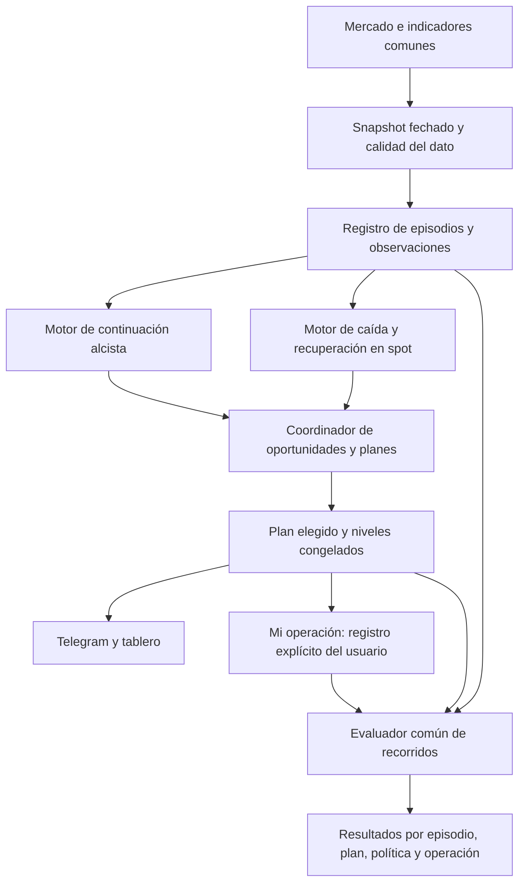

# Plan de evolución de SACBinance

**Versión de este plan:** 1.0 · 22-sep-2026 UTC. **Estado:** planificación terminada; implementación pendiente. Nombre de trabajo: «vNext por episodios». No se ha asignado una nueva versión de producto ni cambiado la emisión.

**Actualizado el 21-sep-2026** con la [adenda de episodio y confianza](ADENDA_EPISODIO_Y_CONFIANZA.md): la ventana del episodio queda fijada en 12 h por decisión del usuario, y la fase 1 pasa de propuesta a código.

Lecturas complementarias: [adenda: episodio y confianza](ADENDA_EPISODIO_Y_CONFIANZA.md), [evidencia y decisiones](EVIDENCIA_Y_DECISIONES.md), [contratos y métricas](CONTRATOS_Y_METRICAS.md), [continuidad para Cloud/Claude](CONTINUIDAD.md), [medición del 21-sep](../../2026-09-21/telegram-signal-review/ANALISIS.md).

## 1. Resultado que debe conseguir la actualización

La nueva versión debe explicar mejor **por qué aparece una oportunidad, a qué movimiento pertenece, qué plan se eligió y qué pasó con esa operación**. Debe poder comparar una entrada de continuación con una entrada posterior a una caída sin confundir sus riesgos o atribuir a una entrada la ganancia de otra.

El éxito no es aumentar el número de alertas ni mostrar un porcentaje más alto. Es mejorar la calidad económica y la trazabilidad de las oportunidades, con una medición que pueda reproducirse y con una experiencia que acompañe la operación elegida por el usuario.

**Para qué se construyó el sistema, y qué impone.** SACBinance existe para analizar el mercado y **operar intradía: entrar y salir en horas, dentro del mismo día**. Eso no es una preferencia de estilo, es una restricción de diseño que atraviesa todo lo demás:

- El horizonte de evaluación es de 12 h y no se alarga. Un plan que necesita dos días para funcionar no sirve para lo que se construyó esto, aunque acabe ganando.
- Un objetivo solo es útil si se cobra dentro de la sesión. Medido sobre los 229 avisos maduros: el 73 % de los que llegan al +3,2 % lo hace en las primeras 6 h, y el máximo del recorrido llega de mediana a las 6,4 h.
- **El 41,9 % de los avisos no resuelve nada en 12 h**, y con el TP actual solo el 25,3 % lo toca antes que el stop. Para un sistema intradía eso es el problema central, no un detalle de calibración: el TP variable (`stop × 2`) apunta más lejos de lo que da el día.
- La ventana del episodio (12 h) coincide a propósito con la jornada de trabajo del sistema: un movimiento que sigue vivo al día siguiente es otro episodio, no el mismo.

Prioridades acordadas:

1. Evaluar +4,2 % **netos** frente a objetivos menores y al TP variable actual.
2. Evolucionar las lecturas alcista y bajista existentes en dos rutas especializadas.
3. Medir correctamente primera señal, señales repetidas y operación tomada.
4. Hacer legible el conflicto entre marcos sin promediar planes incompatibles.
5. Mantener la continuidad con el trabajo realizado en Cloud/Claude.

**La ruta bajista es para spot:** reconocer caída, evitar anticipar una compra y detectar recuperación/rebote. No se construirán cortos ni ejecución de órdenes en este alcance.

## 2. Qué conservar y qué cambiar

### Conservar

- Ingestión única de mercado, indicadores y buffers por marco.
- Reconstrucción de huecos, observación de velas cerradas y retención existente, verificando su cobertura efectiva.
- Detección actual de rupturas, impulso, retroceso, niveles, compresión y contexto macro.
- Selección actual de Telegram como referencia de comparación.
- Niveles congelados por plan notificado, eventos TP/SL y edición del mensaje original.
- Métricas históricas existentes, con su definición y procedencia originales.
- Funcionamiento manual del servicio local; no instalar autoarranque.

### Cambiar de forma gradual

- La identidad de un aviso no dependerá de que pueda abrirse una fila nueva en `signals`.
- La operación del usuario será independiente de la alerta visual más reciente.
- Los niveles se guardarán como versiones inmutables de un plan; una revisión no alterará el pasado.
- La medición de ejecución y la observación del recorrido compartirán un evaluador temporal, pero tendrán desenlaces distintos.
- Los porcentajes de la UI identificarán población, horizonte, costes, versión y unidad de conteo.
- Los objetivos fijos, el mínimo para avisar y los hitos informativos tendrán configuraciones separadas.
- La lectura bajista de spot ofrecerá estado de riesgo y condiciones de recuperación, no un TP vendedor presentado como una compra posible.

## 3. Arquitectura propuesta

Son **dos rutas de análisis dentro del mismo sistema**, no dos servidores con datos y estadísticas separados. Comparten hechos observados y contratos; cada ruta conserva su pregunta, estado y evaluación. La primera implementación puede usar reglas interpretables. Un modelo entrenado solo se incorpora si mejora a una referencia sencilla fuera de muestra.

### Motor A: continuación alcista

Pregunta: «¿Hay una compra de continuación razonable desde este momento, con este objetivo, esta invalidación y este horizonte?»

Familias candidatas:

- Ruptura y continuidad sostenida.
- Ruptura con retest válido.
- Pullback dentro de una tendencia aún vigente.
- Expansión después de compresión.
- Movimiento extendido o agotamiento: observar/descartar según la política, no perseguir automáticamente.

Evidencia: estructura por marco, nivel roto, cierres de confirmación, impulso, volumen relativo, liquidez, distancia a resistencia, recorrido consumido, volatilidad y régimen. Cada valor debe existir antes de la decisión y tener un reloj de observación.

Salida: estado de la tesis, razones, datos faltantes, política candidata, invalidación y ranking en sombra. Una probabilidad solo se publica cuando exista calibración para su pregunta y horizonte.

### Motor B: caída y recuperación en spot

Preguntas distintas:

1. «¿La caída sigue activa o se está estabilizando?»
2. «¿Apareció una recuperación que justifique evaluar una **nueva compra**?»

Estados de trabajo:

`CAIDA_ACTIVA → DESACELERACION → BASE_EN_FORMACION → RECUPERACION → REBOTE_CONFIRMADO`

En cualquier estado puede haber nueva caída, invalidación, caducidad o datos insuficientes. La secuencia no es obligatoriamente lineal; cada transición debe tener una regla explícita y persistida.

Familias candidatas:

- Caída que continúa: evitar anticipar el suelo.
- Retroceso dentro de una estructura alcista mayor.
- Barrida de un nivel y recuperación posterior confirmada.
- Rebote débil que vuelve a perder soporte.
- Base y recuperación sostenida.

Las familias son hipótesis operativas; no se afirmará que ya predicen resultados. La etiqueta futura «cayó y luego subió» puede usarse como resultado de investigación, nunca como criterio de entrada conocido de antemano.

El nuevo plan comprador nace **después del disparador de recuperación definido**, con nueva entrada, nueva invalidación y nuevo reloj. Si un plan anterior salió por SL, conserva esa pérdida aunque el precio después suba 8 %.

### Coordinador: relevancia sin un consenso artificial

El coordinador muestra qué marco describe el contexto y cuál dispara una entrada. Por ejemplo, una caída de 5m puede ser un pullback dentro de una estructura alcista de 1h; eso no hace idénticos ambos planes ni obliga a votar una única dirección.

No se promediarán TP/SL de marcos distintos. Los planes alternativos mantienen sus niveles, horizonte y estado. Un conflicto puede producir «esperar» en lugar de inventar una confianza intermedia.

Primera regla operativa a conservar: un plan notificado abierto por símbolo. Registrar los candidatos bloqueados para investigar, sin confundir el bloqueo de capacidad con mala calidad. Cambiar esa regla requiere una prueba específica de cartera y exposición.

Si varios candidatos compiten por el mismo movimiento, el coordinador selecciona según una política declarada **con información disponible en ese momento**. No podrá escoger retrospectivamente el que terminó ganando. Inicialmente se conserva la selección actual; las alternativas se calculan en sombra.

## 4. Primera señal y operación del usuario

### La ventana del episodio, congelada el 21-sep-2026

Un episodio de compra se cierra por **lo primero que ocurra**:

| | Motivo | Regla |
|---|---|---|
| 1 | `DESENLACE` | el plan vigente tocó su objetivo o su stop |
| 2 | `ANCLA` | el candidato nuevo se apoya en otro nivel estructural (> 2,5 % de diferencia) |
| 3 | `SILENCIO` | 12 h sin candidato nuevo del mismo símbolo y dirección, contadas desde el último |
| 4 | `CADUCIDAD` | 12 h desde la apertura sin resolución |

Las 12 h no son un número redondo: son el horizonte que ya usa el sistema (`signal_expiry_hours`), el reloj del plan notificado y el punto donde el 82 % de las repeticiones de Telegram todavía no ha llegado — la mediana entre dos avisos del mismo par es de **21 h**. Con 4 o 6 h se partirían movimientos que hoy son uno solo; con 24 h se fundirían dos, porque a partir de ese hueco la segunda entrada ya difiere un 7,7 % de la primera y solo el 40 % cae dentro de los niveles del primer plan. La tolerancia del ancla sale de la misma medición: dentro de 12 h el stop estructural se mueve 0,20 % de mediana y el 90 % no pasa del 2,62 %.

Con esta regla, **212 de los 229 avisos maduros de Telegram (92,6 %) ya son la primera de su episodio**: la política de un plan abierto por símbolo hace casi todo el trabajo. Donde la regla sí cambia la medición es en el universo interno, donde la mediana entre alertas del mismo par es de 2,5 h.

**Advertencia que cambia una decisión de diseño:** el hallazgo anterior de que «la primera señal es la buena» **no se reproduce** en los datos actuales. Con esta ventana, sobre 4.513 señales evaluables: 1ª 23,7 % toca TP antes que stop, 2ª 30,5 %, 5ª o posterior 30,2 %. La política de «primera del episodio» sigue siendo necesaria como **unidad de conteo** —evita contar diez veces el mismo movimiento— pero **no como criterio de calidad**, y debe probarse en sombra antes de darle ningún peso.

### Los tres resultados

Se necesitan tres resultados simultáneos y separados:

- **Calidad de todas las señales:** qué habría pasado con cada plan, reconociendo la dependencia entre repeticiones.
- **Política de primera oportunidad del episodio:** qué habría pasado al tomar la primera oportunidad elegible y respetar su salida.
- **Mi operación:** qué entrada y cantidad registró el usuario, qué plan eligió y cómo salió realmente o qué parte permanece abierta.

Ejemplo solicitado, con entrada ilustrativa 100:

1. Señal A: TP +4,87 %, SL −2,45 %. El usuario marca «Tomé esta entrada».
2. Se crea una operación vinculada al plan A, con precio/hora/cantidad registrados. Si no introduce una ejecución real, se identifica como seguimiento simulado, no operación ejecutada.
3. Señal B: aparece después con otros niveles y acaba en SL.
4. A sigue evaluándose contra **su** entrada y niveles. Si alcanza su TP con el modelo de coste 0,5 puntos, su resultado simulado es +4,37 % neto. B no reduce ese resultado.
5. B se conserva en la evaluación de señales y se vincula al episodio como actualización o alternativa no tomada. No se borra su pérdida para mejorar el porcentaje.
6. Si el usuario sí abre otra compra, se registra explícitamente como otra operación o una ampliación con eventos de ejecución. Nunca se deduce de que apareció otro mensaje.

La relevancia se resuelve **mediante identidad y políticas de conteo**, no buscando un promedio que haga coincidir todos los resultados.

## 5. Objetivos y stops

### Política propuesta para la primera prueba

- Referencia: TP/SL actuales, congelados.
- Rival principal: salida fija **+4,2 % neto**, equivalente a +4,7 % bruto bajo el coste aditivo de 0,5 puntos de este estudio.
- Comparadores: +3,2 % neto y +2,7 % neto, con las mismas entradas, stops y ventanas.
- +5,2 % queda como exploración registrada, sin optimizar continuamente el objetivo mirando el último resultado.

Medido sobre los 229 avisos maduros, con el stop de cada plan, ventana de 12 h y coste de 0,5 puntos:

| Objetivo | Llega antes que el stop | Esperanza por señal |
|---|---|---|
| +3,2 % neto | 46,7 % | +0,33 % |
| +3,7 % neto | 42,4 % | +0,40 % |
| **+4,2 % neto** | **39,3 %** | **+0,51 %** |
| +4,7 % neto | 34,9 % | +0,58 % |
| TP actual (`stop × 2`, mediana +6,72 % bruto) | 25,3 % | +0,47 % |

El rival de +4,2 % neto se sostiene: **acierta 1,6 veces más que el TP actual con esperanza igual o algo mejor**. Pero las diferencias entre filas están dentro del ruido —el intervalo del 95 % de la esperanza actual es [−0,04 %, +0,99 %]—, así que lo que cambia de verdad al acercar el objetivo no es cuánto se gana, es **cuántas veces se cobra**. Esa es una elección del usuario sobre cómo operar, y encaja con el propósito intradía de la sección 1.

Este experimento debe medir tanto el resultado por plan sobre una cohorte común como una política cronológica de cartera. Una salida anterior libera capital y puede cambiar las siguientes entradas posibles; eso no se observa sumando medias por señal.

No convertir el rival de +4,2 % en valor por defecto hasta pasar las puertas de validación. No cambiar `objetivo_operador_pct` como atajo: ese ajuste filtra candidatos y no representa por sí solo una salida fija.

### Stops

El stop se define antes de la entrada por invalidación, ruido y restricciones de riesgo. La actualización no enseña a soportar cualquier caída. Se estudiará por separado:

- Probabilidad de tocar el stop antes de la meta.
- Profundidad y duración del retroceso antes del objetivo.
- Recorrido posterior al stop, como información de una posible nueva oportunidad.
- Tamaño de posición para mantener constante el riesgo monetario.
- Coste y peor ejecución plausible en el stop, especialmente con saltos de precio.

Un experimento de stop más ancho debe reducir posición cuando corresponda y comparar el resultado con igual presupuesto de riesgo. Los stops de operaciones ya tomadas no se ensanchan automáticamente al aparecer una nueva lectura.

### La confianza que se puede publicar

Medido el 21-sep: **la puntuación actual no ordena**. En los avisos de Telegram, el tramo 70–79 acierta el 27,0 % de los TP y el 90–101 solo el 7,7 %; sobre las 4.513 señales su AUC para «llega al +3,2 % antes que al stop» es 0,580, y 0,535 en el tramo reciente. Las columnas que parecen predecir (`atr_pct` 0,662, `rango_1h_pct` 0,635) miden amplitud del movimiento: comprobado fuera de muestra en los 7 días posteriores al estudio del 14-sep, `rango_1h_pct` cae a AUC 0,596 y su ventaja económica desaparece (+0,08 % frente a +0,16 % de no filtrar). Y cuando el objetivo se expresa en múltiplos del riesgo del propio plan, **no queda nada**: la mejor columna da 0,541 y el score 0,502, y las que encabezan un periodo no son las del siguiente.

Lo único que mueve la probabilidad de forma estable es la geometría —0,5 R: 73,4 %; 1 R: 52,0 %; 1,5 R: 39,3 %; 2 R: 25,3 %— y el régimen, que movió la tasa base de 1 R del 37,3 % al 52,8 % entre las dos mitades del periodo.

Contrato propuesto, en lugar de un número de 0 a 100:

> **«Probabilidad de tocar +X % neto antes que el stop, dentro de 12 h: NN %»**, con la muestra y la ventana temporal en las que se estimó.

1. Se estima como **tasa base condicionada** a (múltiplo de R × régimen × escenario) sobre ventana móvil reciente; hoy es el único estimador que los datos respaldan.
2. **Cada objetivo tiene su número.** Prohibido reutilizar el de +3,2 % cuando el plan apunta a otra cosa.
3. Por debajo de **50 observaciones** en la celda se muestra «sin estimación fiable», no una cifra bonita.
4. Se reestima con ventana móvil y **se muestra su fecha**: con la tasa base moviéndose 15 puntos en una semana, una calibración vieja es desinformación.
5. Afirmar que algo **ordena señales** requiere antes capturar el universo no avisado (sección 6) y una validación temporal con episodios enteros en la misma partición. Hasta entonces, la posición honesta es que sabemos elegir la geometría del objetivo, no la señal.

## 6. Revisión por componente y trabajo concreto

### Ingestión, reloj y calidad

**Base:** `data_ingestion/ws_manager.py`, `hydrator.py`, `main.py`, `state/engine.py`.

Añadir al snapshot edad del dato, cierre efectivo de cada marco, estado del flujo y calidad de cobertura. Conservar la diferencia entre dato desconocido y cero. El evaluador debe recuperar desde el primer minuto no observado, sin duplicar velas ni enviar hitos antiguos como avisos nuevos. Proteger la retención de la evidencia de experimentos y operaciones; exportar antes de purgar lo necesario.

### Indicadores, estructura y régimen

**Base:** `indicators/calculator.py`, `ma_slopes.py`, `macro_gate.py`, `levels.py`, `impulse.py`, `retroceso.py`, `compression.py`.

Crear un snapshot común versionado; preservar el marco de cada valor. Registrar el régimen por plan, no solo a través de un `outcome` que puede faltar. Los clasificadores pueden reutilizar indicadores existentes; no añadir señales redundantes solo para aparentar mayor confianza.

### Episodios y detección

**Base:** `ruptures.py`, `tf_rupture.py`, `state_machine.py`, `symbol_state.py`, `state/engine.py`.

Persistir identidad de episodio, ancla estructural, estado y relación con observaciones de cada marco. La asociación será causal: nunca agrupar según un mínimo o máximo que todavía no ocurrió. El episodio se invalida o caduca por una regla; los cambios posteriores se guardan como eventos. Una caída dentro de una tesis alcista mayor puede ser una fase del episodio o una tesis distinta, según su ancla, sin perder el vínculo de contexto.

### Planes, selección y riesgo

**Base:** `trade_levels.py`, `notify/policy.py`, `notify/service.py`.

Dar identidad propia a todo plan aunque `abrir_senal()` devuelva `None`. Separar elegibilidad, ranking, presupuesto de avisos y gestión de posiciones. La prioridad actual por R:R necesita una referencia: si muchos planes tienen R:R fijado en 2, ese criterio discrimina poco. Cualquier nuevo ranking debe probarse en sombra frente al actual.

### Seguimiento y resultados

**Base:** `signal_tracker.py`, `outcome_tracker.py`, `rupture_tracker.py`, `tf_rupture_tracker.py`, `notify/policy.py`.

Introducir un evaluador común con adaptadores. Primero comparar sus salidas en sombra contra las existentes; no reemplazar todos los trackers a la vez. Revisar especialmente el reloj de vencimiento, la vela del fill y el registro de barreras anterior/posterior al fill. El resultado de retest no puede usar un máximo que sucedió antes de comprar dentro de la misma vela.

Las rupturas por marco necesitan versión del detector, configuración, evaluador, calidad y cobertura persistidas. Sus tablas actuales no incluyen esos campos de procedencia. Un indicador `closed` no acredita cobertura ni que el plan se pudiera ejecutar.

### API y tablero

**Base:** `api/routes.py`, `frontend/src/types/index.ts`, `Historial.tsx`, `SignalStats.tsx`, `PairCard.tsx`, `AnalisisPar.tsx`, `domain/analysis.ts`.

Añadir vistas explícitas de «Mercado», «Oportunidades», «Mi operación» y «Resultados». Mantener los contratos antiguos durante la transición. En resultados, permitir elegir Telegram, todas las señales, primera por episodio o mis operaciones; mostrar horizonte y modelo de coste. El plan tomado debe seguir visible aunque la tarjeta general cambie de escenario.

Eliminar la dependencia de textos fijos de +3,2 % en varias capas: el mensaje debe recibir el objetivo y su tipo bruto/neto desde el contrato del plan. No reutilizar una probabilidad antigua con un nuevo objetivo.

### Telegram

**Base:** `notify/service.py`, `notify/policy.py`, `notify/telegram.py`.

Mantener un hilo por plan seleccionado y las protecciones de deduplicación. Mostrar identificador legible, marco disparador, contexto, entrada, TP, SL y costes estimados. Las actualizaciones de mercado del episodio deben indicar si afectan una operación ya tomada o solo describen una oportunidad nueva.

La primera fase de «Tomé esta entrada» puede vivir solo en el tablero. Botones o respuestas interactivas de Telegram son una mejora posterior, porque requieren recepción de eventos, autorización del usuario correcto y tratamiento de duplicados. El módulo actual de envío no acredita ese circuito entrante.

### Persistencia, rendimiento y despliegue

**Base:** `persistence/db.py`, `utils/procedencia.py`, `main.py`, `deploy/`.

Migraciones aditivas, índices por identidad y reloj, verificaciones reales de filas insertadas y recuperación tras reinicio. No ejecutar entrenamiento en el bucle de velas. Registrar un identificador de código que contemple los archivos efectivos; un HEAD antiguo con cambios sin commit no basta.

Antes de aceptar la carga adicional, medir tiempos del ciclo y colas con el mismo replay. Propuesta de guardia: no degradar más de 10 % el p95 respecto a la base medida, ni acumular el procesamiento de una vela dentro de la siguiente. Estos umbrales son criterios de aceptación propuestos, no resultados medidos en este análisis.

## 7. Fases de implementación

Cada fase debe terminar en un cambio revisable con evidencia de aceptación. Los nombres de módulos nuevos son propuestos y se fijarán al iniciar la fase correspondiente. No reservar ahora un número de migración que otro colaborador pueda estar utilizando.

### Fase 0 — Base y contrato compartido

**Estado de esta fase:** investigación y plan completados en este paquete; falta unificar cualquier propuesta adicional de Cloud antes de programar.

Entregables: snapshot, manifiesto, evidencia, plan, contratos, continuidad y pruebas base. Al iniciar implementación, comprobar otra vez cambios locales/remotos, elegir una base revisable que incluya el trabajo sin commit y asignar responsables por archivo.

Aceptación: ambos planes de trabajo usan las mismas definiciones; se conoce qué código se desplegaría; no se pierde ningún cambio previo. Siguiente fase autorizable: identidad y observación aditiva.

### Fase 1 — Identidad por episodio y plan, en sombra

**Estado a 22-sep-2026: desplegada en producción, en sombra** (ver [DESPLIEGUE_FASE1.md](DESPLIEGUE_FASE1.md)). Esquema v16 (aditivo), `backend/src/episodios/registro.py`, integración en `engine._registrar_identidad()`, `db.registro_episodios()` y el barrido del bucle de mantenimiento en `main.py`. Ajustes nuevos: `episodio_registro_enabled`, `episodio_silencio_horas` (12) y `episodio_ancla_tolerancia_pct` (2,5). 17 pruebas nuevas; 79 en total en verde. No se ha tocado producción ni la emisión: el registro corre **después** de que la alerta ya salió, y cualquier fallo suyo se traga sin llegar al operador.

Añadir repositorio de episodios, planes inmutables y enlaces de fuentes. Toda alerta nueva obtiene `plan_id`, independientemente de `signal_id`. Capturar las características en ese momento. Enlazar alertas, notificación y rupturas sin reciclar IDs.

Archivos de integración: `engine.py`, `db.py`, `procedencia.py`, adaptadores de `ruptures.py`/`tf_rupture_tracker.py`. Añadir módulos aislados para contratos y registro; no introducir entrenamiento.

Aceptación:

| | Criterio | Estado |
|---|---|---|
| ✅ | 100 % de alertas nuevas con niveles coherentes obtienen `plan_id` y snapshot, con o sin `signal_id` | probado (`test_an_alert_without_signal_id_still_gets_its_own_plan`) |
| ✅ | Reiniciar no cambia el primer plan del episodio ni crea duplicados | probado (idempotencia por `legacy_alerta_id` y estado en tabla, no en memoria) |
| ✅ | Un stop seguido de una subida conserva el stop | probado (`test_a_later_rise_does_not_rewrite_the_stop`) |
| ✅ | El registro no puede alterar ni romper la emisión | probado (corre tras emitir; el fallo se traga; interruptor `episodio_registro_enabled`) |
| ✅ | Migración ensayada: aditiva, sin perder filas y sin parada perceptible | `ensayo_migracion_v16.py` — 179 MB, 200.000 alertas y 1,5 M de velas: **10 ms**, integridad `ok`, ninguna fila cambiada, columnas nuevas a NULL en las filas antiguas |
| ✅ | Ensayo sobre copia de la base **real** de producción | 898 MB copiados en 4,5 s con el servicio escribiendo; salto v15→16 en **28 ms**, integridad `ok`, ninguna fila cambiada |
| ⏳ | Comprobación de 24 h de que la emisión no cambia | en curso desde el 22-sep 02:22 UTC. A los 2 min: 100 % de las alertas nuevas con identidad, 0 errores |

### Fase 2 — Evaluador común y métricas por plan

**Estado a 22-sep-2026: desplegada en producción, en sombra** (ver [DESPLIEGUE_FASE2.md](DESPLIEGUE_FASE2.md)). `backend/src/evaluacion/` (núcleo puro, almacén y adaptadores), esquema v17 aditivo, pasada en sombra en el bucle de mantenimiento, ajustes `evaluador_recorridos_enabled` y `evaluador_max_planes_por_pasada`. 18 pruebas nuevas; **97 en total en verde**.

**La comprobación que importa:** el evaluador nuevo se pasó, en solo lectura, por los **190 planes notificados ya resueltos** de producción y reprodujo la etiqueta del sistema en **190 de 190 (100 %)**, sin una sola discrepancia que explicar. Cero velas ambiguas, cobertura suficiente en todos, y un hueco de precio detectado y ejecutado en la apertura.

Implementar el evaluador puro y los adaptadores de replay/streaming. Guardar desenlace de política y recorrido por horizonte por separado. Mantener la implementación anterior como comparación hasta explicar todas las diferencias.

Archivos de integración: los cuatro trackers, `notify/policy.py`, `db.py`. Introducir pruebas de reloj, cobertura, fills, barreras simultáneas y reinicio.

Aceptación:

| | Criterio | Estado |
|---|---|---|
| ✅ | Replay y streaming coinciden para el mismo conjunto ordenado de eventos | probado, incluida entrega repetida, solapada y con reinicio a media serie |
| ✅ | Un stop seguido de una subida conserva el stop como resultado | probado: el desenlace se congela y el recorrido sigue registrándose aparte |
| ✅ | Un hueco material no se convierte en victoria | probado: una vela que abre bajo el stop ejecuta en la apertura, no en el nivel; barreras simultáneas en un minuto → stop y marca `ambiguo` |
| ✅ | La ventana abierta no entra como cerrada | probado: sin desenlace no hay resultado, y `completa` va en la fila |
| ✅ | Las métricas antiguas siguen disponibles con su definición | no se tocó ningún tracker; las tablas nuevas son otras |
| ✅ | Comparación en sombra contra la implementación anterior | 190/190 en producción, sin discrepancias |
| ⏳ | Un cambio de TP crea otra versión del plan | pendiente: las revisiones de plan llegan cuando el motor pueda actualizar niveles (fase 4) |
| ✅ | Desplegado y midiendo en vivo | 22-sep 02:57 UTC. Migración v17 en 14 ms sobre la copia de 901 MB, 97 pruebas en verde en el servidor, 47 recorridos evaluados al minuto de arrancar |

### Fase 3 — Registro de la operación elegida

**Estado a 22-sep-2026: desplegada en producción** (ver [DESPLIEGUE_FASE3.md](DESPLIEGUE_FASE3.md)). Esquema v18 (aditivo), `backend/src/operaciones/diario.py`, endpoints `GET/POST /api/operaciones…`, y en el tablero «Tomé esta entrada» dentro del detalle del par más la sección «Mis operaciones». La alerta viva lleva ahora su `plan_id`, así que una operación se enlaza con el plan exacto que se tomó. 12 pruebas nuevas en backend y 5 en frontend; **113 y 34 en verde**.

Crear seguimiento explícito del usuario y API/UI mínima de «Tomé esta entrada». Guardar el plan elegido, precio, hora y cantidad; diferenciar simulación, ejecución declarada y ejecución importada. Registrar cierre, parciales y modificaciones como eventos.

Aceptación:

| | Criterio | Estado |
|---|---|---|
| ✅ | El ejemplo A ganadora / B perdedora deja intacto el resultado de A | probado con los números del plan: A cierra en +4,37 % neto mientras B acaba en stop |
| ✅ | Una B no tomada no cuenta en «Mis operaciones» | probado: el diario solo tiene la operación que se registró |
| ✅ | No se registra una compra por el mero envío de Telegram | probado: alertas emitidas y un plan notificado dejan el diario vacío |
| ✅ | Una pérdida y una reentrada son dos operaciones, con saldo correcto | probado: −2,95 % y +5,62 %, suma +2,67 %, una positiva de dos |
| ✅ | Los niveles se copian al abrir y no los mueve un plan posterior | probado: cambiar el TP del plan no toca la operación |
| ✅ | Simulado y declarado no se suman | probado en backend y en el tablero: no existe una función que devuelva «el total» |
| ✅ | Desplegado | 22-sep 03:27 UTC. Migración v18 en 24 ms sobre la copia de 904 MB, 113 pruebas en verde en el servidor, endpoints comprobados por sus rechazos sin crear ninguna fila |
| ⏳ | En uso | pendiente de que el usuario registre su primera operación real |

Además, dos reglas que el plan no pedía y los datos aconsejan: un parcial pondera el precio de salida por cantidad y cierra la operación cuando no queda nada; y **cancelar no es una pérdida de cero** — es que no hubo operación, así que no entra en ningún agregado.

Esta fase puede avanzar después de la identidad básica, mientras el evaluador termina su comparación, pero no mostrará resultados nuevos como definitivos antes de aprobar la fase 2.

### Fase 4 — Dos rutas de análisis y captura de patrones

**Estado a 22-sep-2026: desplegada en producción, en sombra** (ver [fase4/FASE4.md](fase4/FASE4.md)). Esquema v19 aditivo, `backend/src/motores/` (contrato, continuación, caída, almacén y servicio), integración en `engine` después de la emisión, ajustes `motores_*` y `motor_caida_*`. 44 pruebas nuevas; **182 en total en verde**.

**La medición que cambió el diseño.** Antes del código se cerró el pendiente que este plan dejaba abierto: reevaluar las rupturas por marco con barreras homogéneas en R ([fase4/MEDICION_RUPTURAS_EN_R.md](fase4/MEDICION_RUPTURAS_EN_R.md)). Sobre 43.500 rupturas maduras con control pareado:

- A **5m el detector es peor que entrar al azar** en el mismo par: −4,32 pp [−5,40, −3,24]. Y 5m es el 72 % de las rupturas, 4.398 alcistas al día.
- A **1h bate al control**: +8,46 pp [+4,23, +12,69], y **aguanta el corte temporal** (+6,96 pp en la primera mitad, +9,94 en la segunda). Es el primer resultado de este proyecto que sobrevive a partir la muestra. Resuelve en 76 min de mediana, así que cabe en la jornada.
- Una **ruptura bajista no anticipa que la caída siga**: 44,1 % contra 45,8 % del control, y con volumen ≥2× cae a 35,8 % contra 45,0 %. La regla popular está del revés en estos datos.
- **Nada ordena**: AUC 0,47–0,53 en todas las columnas, `confirmada` exactamente 0,500, confluencia 0,506.

Por eso el motor de continuación **se ancla en 1h**, el de caída **no tiene ninguna familia que prediga continuación** y la confluencia se guarda pero no pondera.

Crear adaptadores de continuación y caída/recuperación sobre el snapshot compartido. Persistir estados, razones y predicciones en sombra para señales, candidatos descartados y una muestra de referencia del universo. No depender solo de candidatos que ya pasaron el filtro comprador.

Comparar primero reglas actuales y referencias sencillas; después, si procede, un modelo compacto entrenado fuera del servidor. La complejidad debe aportar una mejora fuera de muestra, no solo un mejor ajuste histórico.

Aceptación:

| | Criterio | Estado |
|---|---|---|
| ✅ | La ruta de caída detecta y sigue mercados donde no hay compra | probado: `CAIDA_ACTIVA` devuelve `ESPERAR` sin niveles |
| ✅ | Un rebote potencial no se marca como compra hasta el disparador declarado | el contrato lo rechaza con `ValueError`; probado también en la secuencia completa |
| ✅ | Existen «esperar», «conflicto» y «datos insuficientes» | veredictos de primera clase, con pruebas propias |
| ✅ | Los dos motores no modifican la emisión | corren tras decidirla, el fallo se traga, interruptor `motores_enabled`; probado con un almacén que revienta |
| ✅ | No depender solo de candidatos que pasaron el filtro comprador | cuatro orígenes, incluida una muestra rotatoria del universo |
| ✅ | Migración ensayada sobre copia de la base real | 916 MB, v18→19 en **19 ms**, integridad `ok`, ninguna fila cambiada |
| ✅ | El motor de caída recorre una caída real de principio a fin | replay sobre 8 caídas de producción de −18 % a −45 %: abre, desacelera, hace base, se recupera, se invalida al perder el suelo y confirma el rebote una sola vez. Una caída que no se recupera da **cero** candidatos |
| ⏳ | Predicciones en sombra sobre datos nuevos | desplegado el 22-sep 06:41 UTC; midiendo |

### Fase 5 — Prueba prospectiva de salidas y selección

Congelar política vigente y rivales, incluida +4,2 % neto. Registrar resultados futuros con las mismas definiciones. Separar experimentos de salida, entrada diferida, stop y filtro de selección. Evaluar primera oportunidad por episodio y cartera con exposición limitada.

Aceptación económica y estadística: cumplir las puertas de la sección 8. Si no se cumplen, la prueba sigue siendo observacional; no se rebautiza un resultado inconcluso como mejora.

### Fase 6 — Presentación unificada de contexto y operación

**Estado a 22-sep-2026: desplegada en producción** (ver [fase6/FASE6.md](fase6/FASE6.md)). Sin migración. `backend/src/presentacion/` (contrato de lectura, oportunidades, resultados por población), `GET /api/contrato`, `/api/oportunidades` y `/api/resultados`; en el tablero, las vistas «Oportunidades» y «Resultados»; en Telegram, identidad de plan y línea de alcance. 298 pruebas de backend y 53 de frontend en verde.

**El defecto que cerró, medido:** el número 3,2 hacía dos trabajos —objetivo **neto** del operador y hito **bruto** de medición— con la misma etiqueta y escrito a mano en quince sitios. Sobre 502 recorridos completos, **37 señales (el 15,5 % de las que el tablero daba por meta cumplida) nunca llegaron al objetivo real**. Además `PairDetail` comparaba el TP bruto contra el objetivo neto, así que avisaba tarde.

**Lo que la vista de resultados hizo visible:** las cuatro poblaciones difieren en **21 puntos de acierto** (38,02 % todas contra 16,67 % la decisoria, esta con n=13). Ninguna mejora que se discuta en este proyecto es de ese tamaño; elegir población en silencio decidía la respuesta.

Completar API versionada, métricas filtrables y Telegram con identidad de plan. Mostrar simultáneamente contexto de mercado y operación tomada. Conservar los desacuerdos entre marcos y el estado de cobertura.

Aceptación: una persona puede identificar qué entrada está siguiendo, cuál fue la primera, qué actualización llegó y qué ganancia es simulada o real; ningún porcentaje bruto aparece como neto. Los consumidores antiguos siguen funcionando hasta su migración explícita.

### Fase 7 — Activación gradual y reversión

Solo activar una política validada y revisada por el usuario. Preparar artefacto de despliegue, migración ensayada, copia de seguridad consistente y procedimiento de reversión. Empezar con una fracción acotada de oportunidades elegibles, definida antes de ver sus resultados, conservando una referencia comparable.

La asignación experimental será por episodio para evitar que repeticiones del mismo movimiento caigan en referencia y rival. No aumentar simultáneamente el presupuesto de avisos o riesgo.

Reversión: desactivar la nueva selección y volver a la política previa; mantener el seguimiento de los planes ya notificados y de las operaciones registradas. No restaurar ciegamente una base antigua que borre eventos posteriores.

## 8. Puertas para declarar una mejora

### Integridad

- Identidad y snapshot completos para los nuevos planes; ausencia de colisiones y modificaciones retroactivas.
- Ventanas, relojes, fills y costes comparables; reporte separado de abiertos, ambiguos e incompletos.
- Ninguna pérdida de decisiones o avisos en las pruebas de sombra y reinicio.

### Resultado económico

- Comparación pareada frente a la política vigente, no únicamente frente a una salida inferior.
- Resultado neto por operación y por unidad de riesgo, con capital y simultaneidad representados.
- Evaluación de costes base y escenario adverso predefinidos.
- Caída acumulada, pérdidas extremas y ocupación de capital dentro de los límites acordados antes del ensayo.

### Evidencia nueva

- Evaluación cronológica posterior al ajuste, con separación de ventanas solapadas y episodios.
- Regímenes y periodos identificados; una política solo se presenta como validada en los contextos que realmente se evaluaron.
- Intervalo de la mejora económicamente relevante, referencia aleatoria comparable y revisiones en fechas prefijadas. No detener la prueba en cuanto salga una cifra favorable.
- El número de filas no sustituye al tamaño efectivo: repetición por símbolo/episodio y correlación de mercado deben incorporarse al análisis.

### Confianza mostrada

- Probabilidad ligada a un evento y horizonte precisos, con calibración comprobada en datos separados.
- Si falta muestra o cobertura, mostrarlo; no producir una cifra aparentemente precisa mediante un fallback de otra pregunta.
- Una nueva versión con mejor ranking pero peor resultado neto no pasa la puerta económica.

No hay un número mágico de señales que garantice rentabilidad. Como criterio operativo provisional, exigir más de un periodo prospectivo y precisión previamente acordada de la estimación antes de promover una política. Los límites monetarios del usuario y la tolerancia a caída de cuenta siguen pendientes de especificar para la fase de cartera; no bloquean las fases de identidad y observación.

## 9. Alcance excluido de esta actualización

- Cortos, margen, futuros o apalancamiento.
- Envío automático de órdenes al exchange.
- Inferir operaciones históricas reales que el usuario no registró.
- Entrenar continuamente en producción o cambiar umbrales cada vez que aparece un resultado favorable.
- Eliminar histórico, reemplazar todos los trackers a la vez o retirar controles de Telegram sin prueba específica.

## 10. Decisión al terminar la planificación

La secuencia recomendada es **identidad → evaluación → operación elegida → motores en sombra → validación → presentación y activación gradual**. El objetivo +4,2 % neto queda incorporado como rival principal a estudiar. El trabajo sobre episodios y operaciones tiene utilidad inmediata aunque finalmente ese objetivo no resulte superior.

Para continuar, usar [CONTINUIDAD.md](CONTINUIDAD.md). Este documento describe trabajo futuro; su existencia no acredita que esas funciones ya estén implementadas ni autoriza desplegarlas en este turno.
